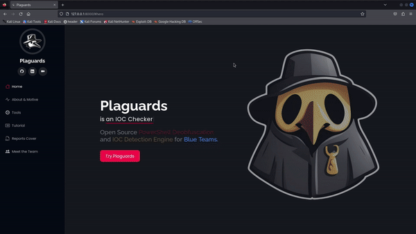
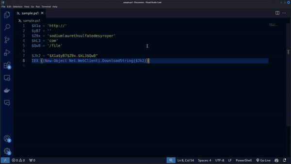

# Plaguards: Open Source PowerShell Deobfuscation and IOC Detection Engine for Blue Teams.

<p align="center" width="100">


</p>

[](https://www.gnu.org/licenses/agpl-3.0)


[](https://www.blackhat.com/asia-25/arsenal/schedule/index.html#plaguards-open-source-powershell-deobfuscation-and-ioc-detection-engine-for-blue-teams-43739)

<p align="justify">Plaguards is a cutting-edge security tool built to streamline and automate the deobfuscation of obfuscated PowerShell scripts, empowering security teams to rapidly identify Indicators of Compromise (IOCs) and determine whether they represent valid threats (VT) or false positives (FP). Each analysis is documented in a comprehensive PDF report, designed to provide deep insights and actionable intelligence.</p>

<p align="justify">As a web app, Plaguards offers users the flexibility to conduct powerful, on-demand analysis from anywhere, at any time, making it invaluable to blue teams tasked with responding to complex malware threats. This innovation not only accelerates workflows but also enhances detection accuracy, positioning Plaguards as a vital asset in proactive threat response.</p>


# Motivation Behind Plaguards

<p align="justify">Plaguards was developed to address a critical need within Incident Response (IR) teams, specifically in handling obfuscated PowerShell scripts—a frequent component in modern malware and ransomware attacks that severely threaten business operations. Despite the availability of numerous deobfuscation tools for JavaScript, there is a notable shortage of static deobfuscation resources for PowerShell, especially amidst the increasing trend of fileless PowerShell-based attacks observed throughout 2024. This gap has left IR teams without effective tools to manage these high-stakes threats.</p>

<p align="justify">Most existing tools only focus on detecting obfuscated PowerShell rather than fully deobfuscating it, leaving a crucial aspect of analysis unaddressed. Plaguards fills this void, enabling automated deobfuscation specifically tailored to PowerShell scripts. It empowers IR teams to swiftly parse through obfuscated lines, identify embedded Indicators of Compromise (IOCs) like IP addresses and URLs, and determine if they represent legitimate threats or false positives.</p>

<p align="justify">Beyond deobfuscation, Plaguards enhances the overall response workflow by providing templated PDF reports, documenting each deobfuscated line and cross-referencing IOCs with threat intelligence. This capability not only aids in real-time threat assessment but also supports IR teams by delivering comprehensive, actionable insights in a clear and organized format.</p>


## Security Warning
> [!WARNING]
> There are known `security vulnerabilities` within certain versions of Plaguards. Before proceeding, please read through Plaguards [Security Advisories]() for a better understanding of how you might be impacted.

## Main Features

|No.|Main Features|Summary|
|:-:|:------------|:----|
|1. | Powershell Deobfuscation| Plaguards introduces deobfuscation features such as:<br>1. Concat strings value and variable.<br>2. Concat strings value that has the same variable.<br>3. Decode base64 -> has 2 patterns: "==" at the end of the string and use "base64fromstring" function.<br>4. Evaluate Backtick.<br>5. Seperate Code into Several Lines -> ";" (semicolon) as the separator.<br>6. Flexible variable value change.<br>7. Arithmatic operation inside char (plus (+), minus (-), multiply (*), divide (/), XOR (-bxor)).<br>8. Evaluate replace.<br>9. Evaluate split.<br>10. Evaluate join.<br>11. Recognize and evaluate whitespace.<br>12. Process ASCII.getstring function.<br>13. Obtain IOC Parameter Input (Domain and IP). |
|2. | IOC Checker| Plaguards offers four parameters for analyzing Indicators of Compromise (IOCs): `hash`, `ip`, `domain`, and `signature`. To initiate a query, users select one of these parameters and provide a second argument as the IOC value to be checked. Plaguards then cross-references this value with public threat intelligence sources, including VirusTotal and Malware Bazaar, via API. The resulting JSON data is parsed into a structured Markdown format, which is then converted into a downloadable, viewable PDF report—delivering actionable insights in a professional, easy-to-read format.|
|3. | Automated Reporting in PDF format.| Plaguards provides automated PDF reporting for both PowerShell deobfuscation results and IOC checker outcomes, all formatted in an easy-to-read template for clear and accessible insights.|

## Requirements

- VPN Server (Recommended for Production Server).
- Domain for HTTPS (Recommended for Production Server).
- Docker
- Docker Compose v2
- Python 3.x
- Port 8000

> [!NOTE]  
> **(No manual installation needed – we’ll handle everything for you!)**

## Deployment and Usage

#### To deploy Plaguards GUI:

1. Clone this repository.

```console
git clone https://github.com/Bread-Yolk/plaguards.git
cd plaguards
```

2. Configure your Virus Total API key. 

> [!TIP]  
> For instructions on obtaining your API key, Click [here](https://github.com/Bread-Yolk/plaguards/wiki/Configure-your-Virus-Total-API-Key).

```console
nano Dockerfile
```

```Dockerfile
# At Dockerfile
ENV VT_API_KEY="your_api_key_goes_here"
```
 
3. Run the setup script.

```console
chmod 777 plaguards.sh
sudo ./plaguards.sh
```

4. By default, Plaguards dashboard will listen at port **8000**.

#### To deploy Plaguards CLI:

1. Clone this repository.

```console
git clone https://github.com/Bread-Yolk/plaguards.git
cd plaguards
```

2. Set up a virtual environment.

```console
python3 -m venv plaguards-venv
source plaguards-venv/bin/activate
```

3. Configure your Virus Total API key. 

> [!TIP]  
> For instructions on obtaining your API key, Click [here](https://github.com/Bread-Yolk/plaguards/wiki/Configure-your-Virus-Total-API-Key).

```console
nano plaguards-cli.py
```

```python
# At plaguards-cli.py  in line 583
VT_API_KEY = "your_api_key_goes_here"
```

4. Install required dependencies.

```console
pip3 install -r requirements.txt
sudo apt-get update
sudo apt-get install -y pandoc texlive texlive-latex-extra texlive-xetex
sudo apt-get install -y texlive-fonts-extra
sudo apt-get install -y apt-utils
cp ./others/eisvogel.latex /usr/share/pandoc/data/templates/eisvogel.latex
```

5. Run Plaguards CLI.

```console
python3 plaguards-cli.py example.ps1
```

> [!NOTE]
> You can also use `.txt` files containing powershell payloads.

```console
python3 plaguards-cli.py obfuscated.txt
```


## Demo for Main Features


|IOC Checker|PDF Report|
|:---------:|:-----------------------:|
| |  |

|Powershell Deobfuscation|PDF Report|
|:---------:|:-----------------------:|
| |  |


## Authors
- [jon-brandy](https://github.com/jon-brandy)
- [LawsonSchwantz](https://github.com/LawsonSchwantz)
- [tkxldk](https://github.com/tkxldk)
